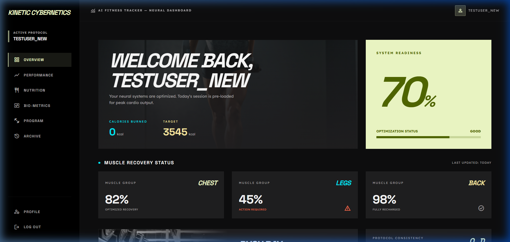
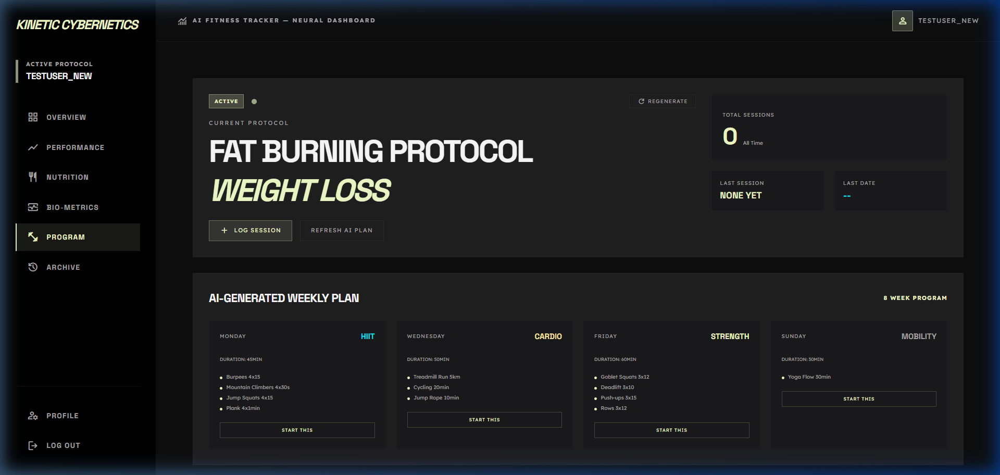
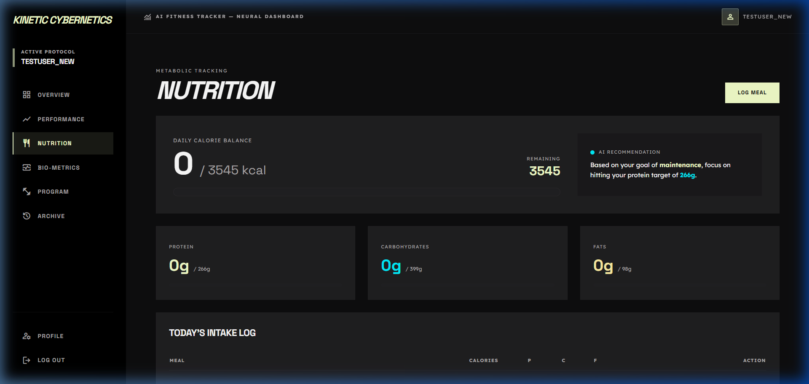
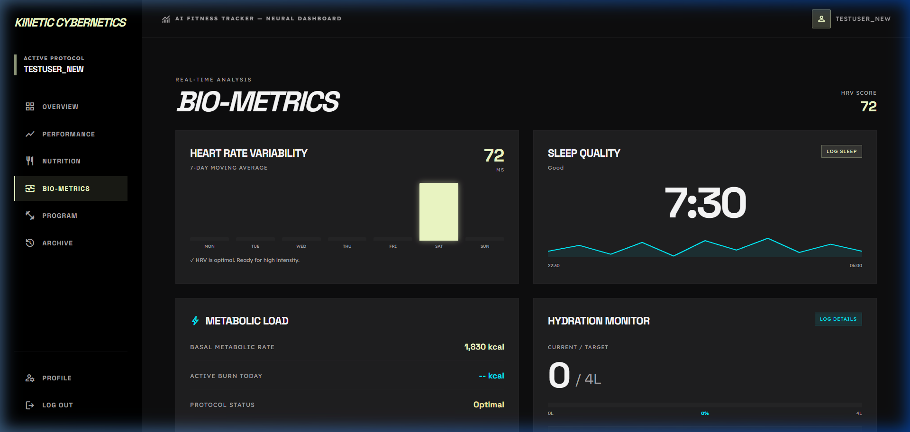
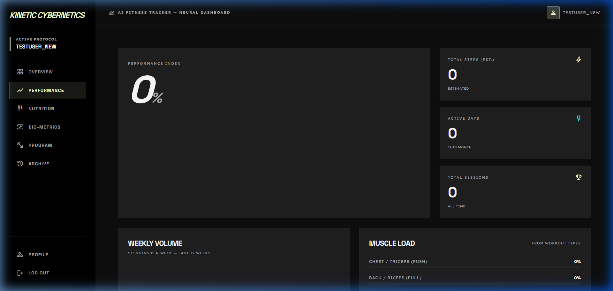
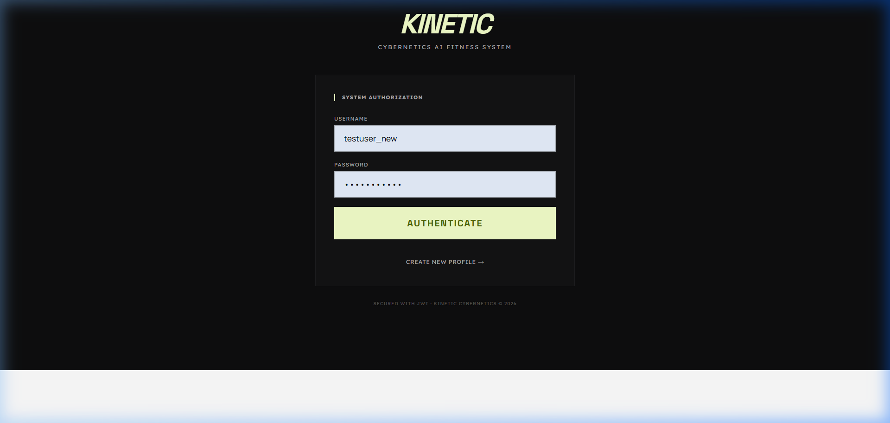

# Kinetic Cybernetics — AI Fitness Ecosystem

Kinetic Cybernetics is a state-of-the-art, neural-inspired fitness tracking ecosystem that leverages Machine Learning to provide personalized nutrition targets, workout recommendations, and bio-metric analysis.



## 🚀 Vision
The system is designed for high-performance individuals who require real-time optimization of their metabolic load, recovery, and performance trends.

---

## 🛠️ Technology Stack

### Frontend
- **Framework**: React 19 + Vite
- **Styling**: Vanilla CSS with TailwindCSS integration
- **State management**: Redux Toolkit
- **Visuals**: Lucide React Icons, Recharts for neural data visualization

### Backend
- **Core**: Spring Boot 3.5.5 (Java 25)
- **Database**: H2 (In-memory for development)
- **Security**: JWT (JSON Web Token) authentication

### ML Service
- **Core**: Python 3.14 + FastAPI
- **Intelligence**: Scikit-learn, Pandas, NumPy
- **Models**: Proprietary calorie prediction and workout recommendation engines

---

## ✨ Core Features

### 1. Neural Dashboard
Real-time overview of your metabolic state, including calorie balance, muscle recovery status, and system readiness.


### 2. AI Workout Architect
The system generates custom 8-week protocols (HIIT, Strength, Cardio, Mobility) based on your specific fitness goals (Weight Loss, Muscle Gain, Endurance).


### 3. Metabolic Tracking (Nutrition)
Dynamic calorie targets calculated via ML, paired with macro-nutrient recommendations tailored to your activity level.


### 4. Bio-Metric Analysis
Real-time monitoring of Heart Rate Variability (HRV), Sleep Quality, and Hydration levels.


### 5. Performance Index
Aggregate scoring of your consistency, volume, and recovery trends.


---

## 🏃 Getting Started

### Prerequisites
- **Java 25**
- **Node.js v24+**
- **Python 3.14+**

### 1. Start the ML Service
```bash
cd ml-service
python -m venv venv
./venv/Scripts/activate
pip install -r requirements.txt
python main.py
```

### 2. Start the Backend
```bash
cd backend
./mvnw spring-boot:run
```

### 3. Start the Frontend
```bash
cd frontend
npm install
npm run dev
```

The application will be accessible at `http://localhost:5173`.

### 🐳 Run with Docker (Recommended)
You can easily spin up the entire ecosystem using Docker Compose:
```bash
docker-compose up --build -d
```
- **Frontend App**: http://localhost:5173
- **Backend API**: http://localhost:8080/api (Swagger: /swagger-ui/index.html)
- **ML Service**: http://localhost:8000 (Docs: /docs)

---

## 🔐 System Authorization

The system uses secure JWT authorization to protect your neural profile and bio-metric data.

---

## 🔧 Infrastructure Updates
The backend has been upgraded to **Spring Boot 3.5.5** to support **Java 25**, ensuring the system runs on the most modern and secure infrastructure available.

---
© 2026 Kinetic Cybernetics. All systems optimized.
